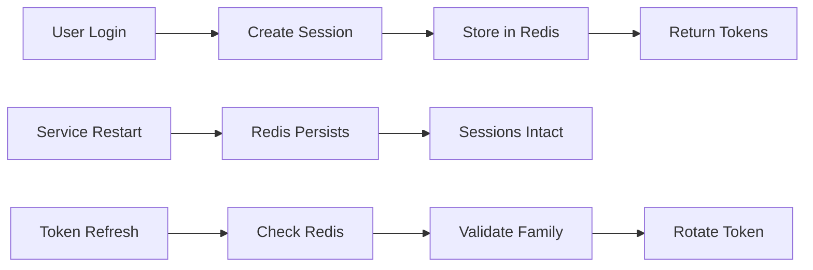

# Enterprise Session Management Guide

## Overview

This guide explains how to enable enterprise-grade persistent session management in PRISM, ensuring user sessions survive service restarts, deployments, and scaling events.

## Problem Solved

By default, PRISM uses in-memory session storage which means:
- ❌ Users are logged out when the backend restarts
- ❌ Sessions are lost during deployments
- ❌ Cannot scale horizontally (multiple backend instances)
- ❌ No session recovery after crashes

With enterprise session management:
- ✅ Sessions persist across service restarts
- ✅ Zero-downtime deployments
- ✅ Horizontal scaling support
- ✅ Automatic session recovery
- ✅ Comprehensive audit trail
- ✅ Enhanced security with token family tracking

## Quick Start

### Option 1: Enable for Development/Testing

```bash
# Start with enterprise features
docker compose -f docker-compose.yml -f docker-compose.enterprise.yml up -d

# Or set environment variable
export USE_PERSISTENT_SESSIONS=true
docker compose up -d
```

### Option 2: Enable in Production

Add to your `backend/.env`:
```env
USE_PERSISTENT_SESSIONS=true
ENVIRONMENT=production
```

## Architecture

### Components

1. **Redis with Persistence**
   - RDB snapshots every 15 minutes
   - AOF (Append Only File) with per-second fsync
   - Automatic cleanup of expired sessions

2. **Enterprise Session Manager**
   - 256-bit secure session IDs (OWASP compliant)
   - Token family tracking with breach detection
   - Distributed locks for race condition prevention
   - Comprehensive audit trail

3. **Graceful Shutdown**
   - 45-second shutdown grace period
   - Forces Redis BGSAVE before shutdown
   - Completes in-flight requests

### Data Flow



## Session Storage Details

### Session Structure
```json
{
  "id": "cryptographically-secure-256-bit-id",
  "user_id": 123,
  "user_email": "user@example.com",
  "roles": ["user", "admin"],
  "status": "active",
  "created_at": "2025-01-10T10:00:00Z",
  "last_activity": "2025-01-10T10:30:00Z",
  "ip_address": "192.168.1.1",
  "user_agent": "Mozilla/5.0...",
  "aal": 1,
  "binding_secret": "session-binding-secret",
  "refresh_count": 5
}
```

### Token Family Structure
```json
{
  "family_id": "uuid-v4",
  "user_id": 123,
  "session_id": "session-id",
  "generation": 3,
  "current_token_id": "current-jti",
  "used_tokens": ["old-jti-1", "old-jti-2"],
  "created_at": "2025-01-10T10:00:00Z",
  "last_rotation": "2025-01-10T10:30:00Z",
  "status": "valid"
}
```

## Security Features

### 1. Token Family Tracking
- Each refresh token belongs to a "family"
- Detects token reuse (potential breach)
- Invalidates entire family on breach detection
- 10-second grace period for legitimate race conditions

### 2. Session Binding
- Each session has a binding secret
- Prevents session hijacking
- Can be validated on sensitive operations

### 3. Distributed Locks
- Prevents race conditions during token rotation
- Uses Redis SET NX for atomic operations
- 30-second lock timeout

### 4. Audit Trail
- All session events are logged
- 90-day retention for compliance
- Searchable by date and session ID

## Monitoring

### Key Metrics

1. **Session Creation Rate**
   ```promql
   rate(session_created_total[5m])
   ```

2. **Token Rotation Rate**
   ```promql
   rate(token_rotated_total[5m])
   ```

3. **Breach Detection**
   ```promql
   sum(token_breach_detected_total)
   ```

4. **Session Duration**
   ```promql
   histogram_quantile(0.95, session_duration_seconds_bucket)
   ```

### Health Checks

Check session persistence status:
```bash
curl http://localhost:8100/api/v1/auth/session/status \
  -H "Authorization: Bearer YOUR_TOKEN"
```

Response:
```json
{
  "user_id": 123,
  "email": "user@example.com",
  "persistent_sessions": true,
  "session_manager_active": true,
  "environment": "production",
  "redis_url": "configured"
}
```

## Troubleshooting

### Sessions Still Lost After Restart

1. **Check Redis Persistence**
   ```bash
   docker compose exec redis redis-cli
   > CONFIG GET save
   > CONFIG GET appendonly
   ```

2. **Verify Environment Variables**
   ```bash
   docker compose exec backend env | grep PERSISTENT
   ```

3. **Check Redis Data**
   ```bash
   docker compose exec redis redis-cli
   > KEYS session:*
   > KEYS token:family:*
   ```

### Performance Issues

1. **Redis Memory Usage**
   ```bash
   docker compose exec redis redis-cli INFO memory
   ```

2. **Slow Session Operations**
   - Check Redis latency: `redis-cli --latency`
   - Monitor slow log: `SLOWLOG GET 10`

### Token Refresh Failures

1. **Enable Debug Logging**
   ```python
   export LOG_LEVEL=DEBUG
   ```

2. **Check Token Family Status**
   - Look for "token_breach_detected" in logs
   - Verify token hasn't been reused

## Migration from In-Memory

### Zero-Downtime Migration Steps

1. **Deploy with Dual Support**
   - Deploy code that supports both in-memory and Redis
   - Existing sessions continue with in-memory

2. **Enable Redis Sessions**
   - Set `USE_PERSISTENT_SESSIONS=true`
   - New logins use Redis

3. **Monitor Migration**
   - Track session creation metrics
   - Verify Redis persistence

4. **Complete Migration**
   - After all in-memory sessions expire
   - Remove in-memory fallback code

## Best Practices

### 1. Redis Configuration
- Always enable both RDB and AOF
- Use authentication (requirepass)
- Monitor memory usage
- Set appropriate maxmemory policy

### 2. Deployment
- Use rolling updates with zero unavailability
- Implement proper health checks
- Set graceful shutdown periods
- Test session persistence regularly

### 3. Security
- Rotate Redis password regularly
- Use TLS for Redis in production
- Monitor for breach detection events
- Implement session timeout policies

### 4. Scaling
- Use Redis Cluster for high availability
- Implement read replicas for session reads
- Consider Redis Sentinel for automatic failover
- Test failover scenarios

## Performance Benchmarks

### Session Operations (with Redis)
- Session creation: < 10ms
- Session retrieval: < 5ms
- Token rotation: < 15ms
- Session invalidation: < 5ms

### Capacity Planning
- Each session: ~2KB in Redis
- Each token family: ~1KB in Redis
- 1M active sessions ≈ 3GB Redis memory
- Redis can handle 100K ops/second

## Compliance

### OWASP Compliance
- ✅ 256-bit session IDs
- ✅ Secure random generation
- ✅ Session timeout enforcement
- ✅ Concurrent session limiting
- ✅ Session fixation prevention

### NIST SP 800-63B
- ✅ Authenticator binding
- ✅ Replay resistance
- ✅ Verifier impersonation resistance
- ✅ Reauthentication support

## Future Enhancements

1. **Session Analytics**
   - User behavior tracking
   - Security anomaly detection
   - Usage patterns analysis

2. **Advanced Security**
   - Device fingerprinting
   - Geolocation validation
   - Risk-based authentication

3. **Performance Optimization**
   - Session data compression
   - Partial session updates
   - Edge session caching

## Conclusion

Enterprise session management transforms PRISM from a development-friendly tool to a production-ready platform. By enabling persistent sessions, you ensure a seamless user experience across deployments while maintaining the highest security standards.